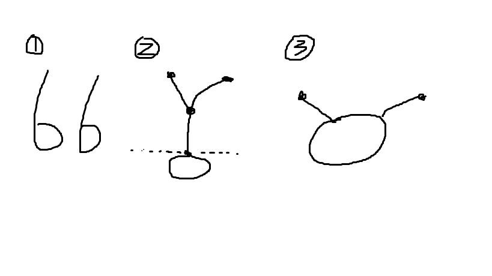

## 牛客算法初级

### coding练习
先完成部分coding 然后再刷视频

todo
    code
        二叉树
            07
    视频 
        6    PPT 5
        
目录
    排序
    基本数据类型
        字符串
        队列，栈
        数组
        链表
    树
        二叉树
        先中后遍历
        完全二叉树
        搜索二叉树
        平衡二叉树
        序列化与反序列化
    
    

### 第一课  简单介绍

#### 认识时间复杂度
常数时间的操作：一个操作如果和数据量没有关系，每次都是 固定时间内完成的操作，叫做常数操作。

时间复杂度为一个算法流程中，常数操作数量的指标。常用O （读作big O）来表示。具体来说，在常数操作数量的表达式中， 只要高阶项，不要低阶项，也不要高阶项的系数，剩下的部分 如果记为f(N)，那么时间复杂度为O(f(N))。

评价一个算法流程的好坏，先看时间复杂度的指标，然后再分析不同数据样本下的实际运行时间，也就是常数项时间

普通二分算法时间复杂度， O(log2N)

#### 例一
一个简单的理解时间复杂度的例子

一个有序数组A，另一个无序数组B，请打印B中的所有不在A中的数，A数 组长度为N，B数组长度为M。

算法流程1：对于数组B中的每一个数，都在A中通过遍历的方式找一下；

算法流程2：对于数组B中的每一个数，都在A中通过二分的方式找一下；

算法流程3：先把数组B排序，然后用类似外排的方式打印所有在A中出现 的数；

三个流程，三种时间复杂度的表达...

如何分析好坏？

时间复杂度分析  
1. O(M*N)
2. O(M*log2N)
3. O(M*logM) + O(N+M),样本不同，分情况考虑

排序算法
1. 冒泡排序，O(N2)  
2. 选择排序，O(N2)  
3. 插入排序  
    1. 最好，O(N)      
    2. 最差，O(N2)  
    3. 平均，O(N2)  

#### 对数器
对数器的概念和使用   
0. 有一个你想要测的方法a，   
1. 实现一个绝对正确但是复杂度不好的方法b，   
2. 实现一个随机样本产生器   
3. 实现比对的方法   
4. 把方法a和方法b比对很多次来验证方法a是否正确。   
5. 如果有一个样本使得比对出错，打印样本分析是哪个方法出错   
6. 当样本数量很多时比对测试依然正确，可以确定方法a已经 正确。  

使用场景  
1. 验证算法正确性  
2. 改进算法，OJ不通过时，线下测，改进  
3. 验证贪心  

TODO 
    面试提前准备各种对数器，数组、二叉树。。。

#### 递归
递归的底层是一层一层的压栈、出栈，任何递归函数都可以改为非递归函数。  
在当前函数内调用自己时，会将当前所有参数、状态，压栈。子过程再调用子过程再次压栈，直到不再调用子过程，返回一个值，从当前栈顶的取出参数，恢复上次递归状态。继续，直到结束递归。

递归的时间复杂度分析：  
master公式的使用  
适用范围：每次递归拆成的子问题的规模一样  
T(N) = a*T(N/b) + O(N^d)  
a,子过程调用次数(就看在一个函数中)，b每次递归拆分的样本规模，d除递归外其他的时间复杂度的指数 
1) log(b,a) > d -> 复杂度为O(N^log(b,a))   
2) log(b,a) = d -> 复杂度为O(N^d * logN)   
3) log(b,a) < d -> 复杂度为O(N^d)  

补充阅读：www.gocalf.com/blog/algorithm-complexity-and-mastertheorem.html

说明的是，当除递归之外的时间复杂度不是简单的几次方时如何解。


####归并排序
时间复杂度O(N*logN)，额外空间复杂度O(N)

原理：指的是将两个已经排序的序列合并成一个序列的操作。归并排序算法依赖归并操作

为什么他快，因为，相较于冒泡排序，没有浪费比较过程，归并就是一直在两个有序数组间排序。

#### 小练习
小和问题:在一个数组中，每一个数左边比当前数小的数累加起来，叫做这个数组的小和。求一个数组 的小和。
```text
例子： [1,3,4,2,5] 1左边比1小的数，没有； 3左边比3小的数，1； 4左边比4小的数，1、3； 2左边比2小的数，1； 5左边比5小的数，1、3、4、2； 所以小和为1+1+3+1+1+3+4+2=16
解：直接利用归并排序，在merge过程中，记录小和。
    记录小何的过程， 3,5    7,9
        在合并两个有序数组时，记录当合并的小和，比如3与7比较，3小，则3比7后面都小，都是他们小和。记录3*2，如果后面的小则不记录

```
逆序对问题:在一个数组中，左边的数如果比右边的数大，则这两个数构成一个逆序对，请打印所有逆序 对。  

解：同小和问题，在merge中找出逆序对时直接打印。

### 第二课 排序算法

#### 快排引入
给定一个数组arr，和一个数num，请把小于等于num的数放在数 组的左边，大于num的数放在数组的右边。

要求额外空间复杂度O(1)，时间复杂度O(N)

解：将数组分为两部分，小数区域，大数区域。
```text
例   [1,21,3,23,44]
小数区域在1之前，大数区域在44之后，index指向数组第一个元素。
如果index的指向的元素小于num,则index指向的元素与小数区域下一个元素交换，小数区域扩大一个，index右移一位
如果index的指向的元素大于num,则index指向的元素与大数区域下一个元素交换，大数区域扩大一个，index不变。
直到index=<大数区域边界
```

#### 荷兰国旗
给定一个数组arr，和一个数num，请把小于num的数放在数组的 左边，等于num的数放在数组的中间，大于num的数放在数组的 右边。

要求额外空间复杂度O(1)，时间复杂度O(N)

解：将数组分为两部分，小数区域，等于区域，大数区域。
```text
例   [1,21,3,23,44]  num 
小数区域在1之前，大数区域在44之后，index指向数组第一个元素。
如果index的指向的元素小于num,则index指向的元素与小数区域下一个元素交换，小数区域扩大一个，index右移一位
如果index的指向的元素大于num,则index指向的元素与大数区域下一个元素交换，大数区域扩大一个，index不变。
如果index的指向的元素等于num,index右移一位。

直到index=<大数区域边界
```

#### 快排
1. 经典快排
取数组最后一个数，将数组分为两部分，左边的比取出的数小，右边的比取出的数大，递归这样的过程，完成排序。
将数组分为两部分的过程，设这个数是X， L,R,C,num,(L小于x的区域，R大于X的区域，c当前指针，num数组),L为-1，R为num.length+1,c为。
开始，如果c指向的数小于等于x则c++,与++l位置交换；如果c指向的数大于x，则c不变，c与--R交换。


经典快排的问题：
极端情况下[1,2,3,4,5]或[5,4,3,2,1,0]时间复杂度将变为O(n^2),这样就会与数据状况有关。
最好情况下，每次分的中间位置，根据master公式，时间复杂度就会变为O(nlogn)


2. 优化后的快排(荷兰国旗方式)
相较于经典快排，他把数组分为三部分，小于X，等于X，大于X；一次排序等于X个数的数，比经典快排一次排一个快。

3. 随机快排
每次随机选择一个数与最后一个数交换，然后进行排序过程，这样也可能遇到最坏情况，这样时间复杂度就会是一个数学期望的问题，
结论：根据概率算出时间复杂度为 O(nlogn)，空间负责度O(logn)  ,logn为打的断点，记录中间区间。

partition(arr,left,right)过程
将数组分为三个部分，小数区域，大数区域，当前位置标记。默认值，小数区域为left~less,[],left=left-1，大数区域，more~right,[],more=right,当前位置index = 0.最后交换more与right位置

```text
伪代码
less = left-1
more = right
index = left
如果index<more,循环进行：
    if arr[index]<arr[right]:
        swap(arr,++less,index++)
    elif arr[index]>arr[right]:
        swap(arr,--less,index)
    else:
        index++   
swap(arr,more,right)     
return [less+1,more]
```

#### 堆排
满二叉树

完全二叉树，对于深度为K的，有n个结点的二叉树，当且仅当其每一个结点都与深度为K的满二叉树中编号从1至n的结点一一对应时称之为完全二叉树。

大根堆(每个节点都比左右孩子节点大)，小根堆

1. 大根堆的建立，时间复杂度O(N)       heapInsert
2. 大根堆中一个数改变，将改变后的数组恢复为大根堆     heapify
3. 重复2

堆的优秀点在于， heapify 调整好 只需要O(logn) 复杂度


数据流求中位数问题？

用大根堆和小根堆实现，吐元素 如果比大根堆堆顶元素大，进小根堆，heapify，始终保持大根堆小根堆的差不不超过1(超过，多的那一个，扔到少的那一个，heapify)

#### 排序稳定性和汇总
稳定性，排好序后的数组中，数值的相对顺序不变 

在相等值之间，相对次序不变。

意义：希望在现实业务中，保留之前的信息(位置信息)
```text
    [1,1,4,5,4,6]
    [1,1,4,4,5,6]
    原数组中第一个1的位置在第二个一个位置之前，在排好序的数组中也是这样的，那就是稳定的。
```

冒泡排序，可以实现为稳定的  
插入排序，可以实现为稳定的  
选择排序，不可以实现为稳定的  
归并排序，稳定的  
快排排序，不是稳定的  
堆排序，不可以实现为稳定的，产生大根堆时直接打算，因为他只能调整父子，不能调整兄弟  


#### 工程中的排序算法

1. 小样本
    当样本量小于60，插排(常数项很低)
1. 大样本
    快排

3. 样本为基础类型，快排     int,float  
3. 样本非基础类型，归并排序    自己定义的类型


有关排序问题的补充： 
1，归并排序的额外空间复杂度可以变成O(1)，但是非常难，不需要掌握，可以搜“归并排序 内部缓存法”  
    非原地归并，原地归并，时间复杂度o(n^2) 
2，快速排序可以做到稳定性问题，但是非常难，不需要掌握， 可以搜“01 stable sort” 
3，有一道题目，是奇数放在数组左边，偶数放在数组右边，还 要求原始的相对次序不变，碰到这个问题，可以怼面试官。面试 官非良人

可以举报面试官的两种情况
1. 面试官阴阳怪气
2. 面试官准备的问题，没有答案，他自己不会


#### 比较器
两个非基础类型，如果排序，按照什么排序。
```text
    比较器返回值
        负数     第一个元素在前      小于
        正数     第二个元素在前      大于
        0       两个元素位置不变    
```    
 
应用：  
排序非基础类型  

1. 排序非重点，调用系统排序，直接排
2. 优先级队列，实际结构 堆。


#### 桶排序，计数排序，基数排序，
1. 非基于比较的排序，与被排序的样本的实际数据状况很有关系，所 以实际中并不经常使用 
2. 时间复杂度O(N)，额外空间复杂度O(N) 
3. 稳定的排序


##### 桶排序，一个萝卜一个坑，与数据状况有关。  

##### 计数排序  
题:规定一个数组的数据范围是0-60，从小到大排序。  
解:准备一个0-60的数组，遍历需要排序的数组，记录数据出现的次数，利用0-60的数组恢复原数组。  

##### 基数排序  

基数排序的基本实现(基于桶排序)    
利用数组链表或者二维数组实现  
1. 申请二维数组或数组链表  
    每次排序
    1. 将当前位j，放到数组[j]中（从前往后家）
    2. 将数组 赋值给待排序数组


优化后的基数排序(基于计数排序，只用一维数组)  
参考
> 基数排序算法的实现与优化  http://www.codebelief.com/article/2017/05/radix-sort-algorithm-implementation-and-improvement/

假设基数为 radix，我们创建一个大小为 radix 的数组 count，count 数组的作用是统计当前位每个数字出现的次数。

每一趟排序的过程如下：  
1. 将 count 数组的每个元素初始化为 0
2. 遍历所有元素，把每个元素的当前位 j 作为 count 数组的下标，count[j]++
3. 从 count 的第二项开始，count[i] = count[i] + count[i-1]
4. 从后往前遍历待排序数组，假设元素当前位为 j，则 count[j] 中存的是当前位小于等于 j 的元素个数，因此当前元素最终的位置应该是第 count[j] 个，下标为 count[j] - 1，故令 bucket[count[j] - 1]  = 当前元素
5. 将bucket中元素重新赋值给待排序数组


小练习  
桶排序 思想  
给定一个数组，求如果排序之后，相邻两数的最大差值，要求时 间复杂度O(N)，且要求不能用非基于比较的排序 

解：MaxGap
1. 设计n+1个桶，保证最大差值不在桶内，鸽笼原理
2. 将n个数，等分到n+1桶里
3. 遍历桶， 取出当前桶最小值与前一个非空桶最大的的差值，找出最大


### 第三课 队列 栈 字符串 数组 链表 

#### 队列、栈
1. 用数组结构实现大小固定的队列和栈


2. 实现一个特殊的栈，在实现栈的基本功能的基础上，再实现返 回栈中最小元素的操作。    
    要求  
    1. pop、push、getMin操作的时间复杂度都是O(1)。 
    2. 设计的栈类型可以使用现成的栈结构

解：用两个栈实现，dataStack，minStack，两个栈同步push,pop,不用的一点是minStack只进比他栈顶小的数，否则进栈顶元素


3. 如何仅用队列结构实现栈结构？ 如何仅用栈结构实现队列结构？
解：两个队列实现一个栈，两个队列实现一个栈

4. 猫狗队列
猫狗队列  【题目】 宠物、狗和猫的类如下：
```java
public class Pet { 
    private String type; 
    public Pet(String type) { 
        this.type = type;
    } 
    public String getPetType() { 
        return this.type; 
    } 
} 
public class Dog extends Pet { 
    public Dog() { 
        super("dog"); 
    } 
} 
public class Cat extends Pet { 
    public Cat() { 
        super("cat"); 
    } 
}

```
实现一种狗猫队列的结构，要求如下： 用户可以调用add方法将cat类或dog类的 实例放入队列中； 用户可以调用pollAll方法，将队列中所有的实例按照进队列 的先后顺序依次弹出； 用户可以调用pollDog方法，将队列中dog类的实例按照 进队列的先后顺序依次弹出； 用户可以调用pollCat方法，将队列中cat类的实 例按照进队列的先后顺序依次弹出； 用户可以调用isEmpty方法，检查队列中是 否还有dog或cat的实例； 用户可以调用isDogEmpty方法，检查队列中是否有dog 类的实例； 用户可以调用isCatEmpty方法，检查队列中是否有cat类的实例。

解：使用两个类，一个封装Pet类（中加类似时间戳，记录次序），另一个实现CatDogQueue队列    
1. 实现一个类封装宠物类，加上count字段，判别次序
2. 实现猫狗队列，拥有catQ队列，拥有dogQ队列，count字段，在add方法中加入pet时，加入count标记，实现其他方法


#### 数组

##### 转圈打印矩阵
【题目】 给定一个整型矩阵matrix，请按照转圈的方式打印它。 例如： 1   2   3   4 5   6   7   8 9  10  11  12 13 14  15  16 打印结果为：1，2，3，4，8，12，16，15，14，13，9， 5，6，7，11， 10   
【要求】 额外空间复杂度为O(1)。  

解：  
思想： 不要纠结于 该打印几行几列  
分解，一个框，一个框的打印,先打印外框在打印内框，循环这个过程
1. 矩阵分层循环打印  
2. 左上点(tR,tC),右下点(dR,dC)
    1. 如果只有一行(包含只有一行一列),直接打印这一行
    2. 如果只有一列，直接打印这一列
    3. 多行多列
    ```text
    1 2 3  
    4 5 6 
    7 8 9  
    比如上图，依次打印 (1,2) (3,6) (9,8) (7,4)
    ```


##### 旋转矩阵
旋转正方形矩阵   
【题目】 给定一个整型正方形矩阵matrix，请把该矩阵调整成 顺时针旋转90度的样子。   
【要求】 额外空间复杂度为O(1)。  

思想：微观-》宏观  
也是把一正方形，一层一层的变化，原地变化，找到需要变换的位置,画图分析，看每个元素旋转前后变换的地方，总结规律  
1. 把正方形矩阵分层旋转
2. 旋转，一次变换四个元素，变换 i (左上点.x - 右下点.x)  次 
3. 初始化i=0; 左上点(tR,tC),右下点(dR,dC)
    ```text
    tmp = matrix[tR][tC + i];
    matrix[tR][tC + i] = matrix[dR - i][tC];
    matrix[dR - i][tC] = matrix[dR][dC - i];
    matrix[dR][dC - i] = matrix[tR + i][dC];
    matrix[tR + i][dC] = tmp;
    ```


##### 之字打印
“之”字形打印矩阵   
【题目】 给定一个矩阵matrix，按照“之”字形的方式打印这 个矩阵，例如： 1   2   3   4 5   6   7   8 9  10  11  12 “之”字形打印的结果为：1，2，5，9，6，3，4，7，10，11， 8，12   
【要求】 额外空间复杂度为O(1)。  

解：  
设计宏观结构，循环打印斜线
1. 设计两个点，一个flag，一个点先向右到边向下走，走到右下角结束；另一个点先向下走后向右走直到走到右下点。两个点同时走，同时到达终点
2. 两个点每走的一步，两点之间连成一条线，循环打印这条线

##### 在行列都排好序的矩阵中找数 
在行列都排好序的矩阵中找数  
【题目】 给定一个有N*M的整型矩阵matrix和一个整数K， matrix的每一行和每一 列都是排好序的。实现一个函数，判断K 是否在matrix中。 例如： 0   1   2   5 2   3   4   7 4   4   4   8 5   7   7   9 如果K为7，返回true；如果K为6，返 回false。   
【要求】 时间复杂度为O(N+M)，额外空间复杂度为O(1)。  

解：  
暴解，遍历数组，O(n^2)复杂度，不符合要求  
因为行列有序，从左下点或者右上点出发，这里从左下点(matrix[row][col])为例，
1. 如果这个点与k相等返回 true
2. 如果小于K值，row--
3. 如果大于K值,col++  
4. 循环123过程，如果越过边界(没找到)，返回 false


   


#### 链表
```text
链表问题
    笔试
        直接解
    面试
        最少空间解
```

##### 反转单向和双向链表   
【题目】 分别实现反转单向链表和反转双向链表的函数。    
【要求】 如果链表长度为N，时间复杂度要求为O(N)，额外空间 复杂度要求为O(1)   
    
解：  
单向链表，使用两个变量，pre,next，表示当前链表的前一个，后一个，遍历链表将 head.next=pre  
双向链表，使用两个变量，pre,next，表示当前链表的前一个，后一个，遍历链表将 head.next=pre head.last=next  


##### 打印两个有序链表的公共部分 
【题目】 给定两个有序链表的头指针head1和head2，打印两个 链表的公共部分。

解：两个有序数组排序 思想 归并merge过程，小的直接 head=head.next 相同打印


##### 判断一个链表是否为回文结构 
【题目】 给定一个链表的头节点head，请判断该链表是否为回 文结构。 例如： 1->2->1，返回true。 1->2->2->1，返回true。 15->6->15，返回true。 1->2->3，返回false。  
进阶： 如果链表长度为N，时间复杂度达到O(N)，额外空间复杂 度达到O(1)。  

普通解：O(n)空间复杂度，O(n)时间复杂度，遍历一个链表，将数据入栈，与另一个链表比较(优化版，快慢指针，只拷贝后一半数据)  
进阶解：O(1)空间复杂度，O(n)时间复杂度，修改链表结构，快慢指针，将链表后半部分逆序，比较  


##### 将单向链表按某值划分成左边小、中间相等、右边大的形式

【题目】 给定一个单向链表的头节点head，节点的值类型是整型，再给定一个 整 数pivot。实现一个调整链表的函数，将链表调整为左部分都是值小于 pivot 的节点，中间部分都是值等于pivot的节点，右部分都是值大于 pivot的节点。 除这个要求外，对调整后的节点顺序没有更多的要求。 例如：链表9->0->4->5>1，pivot=3。 调整后链表可以是1->0->4->9->5，也可以是0->1->9->5->4。总 之，满 足左部分都是小于3的节点，中间部分都是等于3的节点（本例中这个部 分为空），右部分都是大于3的节点即可。对某部分内部的节点顺序不做 要求。  
进阶： 在原问题的要求之上再增加如下两个要求。 在左、中、右三个部分的内部也做顺序要求，要求每部分里的节点从左 到右的 顺序与原链表中节点的先后次序一致。 例如：链表9->0->4->5->1，pivot=3。 调整后的链表是0->1->9->4->5。 在满足原问题要求的同时，左部分节点从左到 右为0、1。在原链表中也 是先出现0，后出现1；中间部分在本例中为空，不再 讨论；右部分节点 从左到右为9、4、5。在原链表中也是先出现9，然后出现4， 最后出现5。   
如果链表长度为N，时间复杂度请达到O(N)，额外空间复杂度请达到O(1)。


普通解： 稳定性不作要求，荷兰国旗问题思路求解，时间复杂度O(n),空间复杂度O(n),不稳定
1. 遍历链表，将链表放入数组中
2. 快排 partition 过程
3. 重新按数组顺序连接链表

  
进阶解： 要求稳定性，荷兰国旗做不到， 三个区域，分为三个区域，三个链表，遍历原链表，判断加入到三个区域中，最后将三个链表整合  


##### 复制含有随机指针节点的链表 
【题目】 一种特殊的链表节点类描述如下： 
```java
public class Node { 
    public int value; 
    public Node next; 
    public Node rand; 
    public Node(int data) { 
        this.value = data;
    } 
} 

```
Node类中的value是节点值，next指针和正常单链表中next指针的意义 一 样，都指向下一个节点，rand指针是Node类中新增的指针，这个指 针可 能指向链表中的任意一个节点，也可能指向null。 给定一个由 Node节点类型组成的无环单链表的头节点head，请实现一个 函数完成 这个链表中所有结构的复制，并返回复制的新链表的头节点。 

进阶： 不使用额外的数据结构，只用有限几个变量，且在时间复杂度为 O(N) 内完成原问题要实现的函数。  

普通解：利用哈希表key-value，先通过遍历原链表，key-value拷贝每一个节点(node,new node)，再次遍历原链表，根据哈希表连接新链表  

进阶解：修改原链表结构，最后恢复，使之能够找到rand节点  
1. 遍历原链表，遍历每个节点生成一个新节点，新节点放到原节点与下一个节点的中间。
2. 遍历原链表，设置新链表rand节点
3. 拆分为两个链表


##### 两个单链表相交的一系列问题 
【题目】 在本题中，单链表可能有环，也可能无环。给定两个 单链表的头节点 head1和head2，这两个链表可能相交，也可能 不相交。请实现一个函数， 如果两个链表相交，请返回相交的 第一个节点；如果不相交，返回null 即可。    
要求：如果链表1 的长度为N，链表2的长度为M，时间复杂度请达到 O(N+M)，额外 空间复杂度请达到O(1)。

问题分解：  
1. 如何判断单链表有环无环
    1. 哈希 表set，O(n)，O(n)
    2. 快慢指针，O(1)
        1. 慢指针走一步，快指针走两步
        2. 如果快指针走完，返回null
        3. 如果快指针与慢指针相遇，那么慢指针回到头结点，快指针一次一步，下一次他们相遇的点就是相交的节点
2. 如何判断两个无环单链表相交
    1. 哈希表，遍历一个链表存入hash表中，再遍历另一个链表，每次判断是否在hash表中
    2. 遍历两个量表回获取len,最后一个节点，比较最后一个节点，是否内存地址一样，如果一样，让较长链表走两个链表长度差值，两个链表在一起走，一定会同时走到第一个节点
3. 一个有环，一个无环，不可能相交    
4. 如何判断两个有环单链表相交
    1. 如果两个两个有环链表，入环节点相同，图二，如果不同，一个链表的入环节点跑一圈都与另外一个入环节点不同，图一，否则图三
    2. 图一，不会相交
    3. 相交，将入环节点下面部分忽略，问题简化为求两个相交的无环单向链表的第一个相交节点
    3. 图中两个与环相交的节点都是相交节点



##### 二分的小扩展,求一个数组里的局部最小值的索引
定义局部最小的概念。arr长度为1时，arr[0]是局部最小。arr的长度为N(N>1)时，如果arr[0]<arr[1]，那么arr[0]为局部最小。如果arr[N-1]<arr[N-2]，那么arr[N-1]是局部最小。如果0<i<N-1，arr[i]<arr[i+1]&&arr[i]<arr[i-1]，那么arr[i]是局部最小。  
给定无序数组arr，已知arr中任何两个相邻的数不相等。写一个函数，只需返回arr中任何一个局部最小出现的位置即可。

解：
>参考：https://blog.csdn.net/zhou_209/article/details/79451685
1. 先考虑第一个和最后一个。若两个都不是，则说明数组中必有一个局部最小(两端向中间的趋势均向下变小)
2. 取中间值，判断其是否为局部最小，若不是，再找比中间值大的那个数，与一端进行二分查找


### 第三课  二叉树

#### 二叉树的前中后、非递归遍历
1. 递归
    1. 前序遍历
    2. 中序遍历
    3. 后序遍历  
可以发现，在递归方式遍历二叉树时，会经过每个节点三次，递归方式前中后遍历不同仅在于第几次打印节点
    
2. 非递归
    1. 前序遍历,拿到节点两次，第一次打印，将头结点放入栈中，循环pop栈顶，打印，如果pop出的节点的右孩子不为空，push进栈，如果左孩子不为空，进栈，直到栈空
    2. 中序遍历,拿到节点两次，第二次打印，栈，如果当前节点不为空，当前节点进栈，当前节点向左，如果当前节点为空，从栈中pop并打印，节点向右
    3. 后序遍历
        1. O(N)空间复杂度方案，先实现中右左(类似于先序遍历)，将打印那一步把节点进入辅助站，最后pop出辅助栈中所有节点，实现左右中
        2. O(logN)空间复杂度方案，对于每一个节点，左孩子入栈，直到左孩子为空， 然后右孩子入栈，直到右孩子为空，如果左右孩子均为空或者已经被打印(左右孩子均已被打印)，则出栈打印
        2. O(logN)空间复杂度方案
            1. 对于每一个节点
            2. if 如果左右孩子都没被打印且左孩子不为空，左孩子入栈
            3. elif 如果右孩子不为空且没被打印过，然后右孩子入栈，直到右孩子为空
            4. else 如果左右孩子均为空或者都已被打印，则出栈打印
            5. tips:如何记录有没被打印过，记录上一个打印的节点

#### 在二叉树中找到一个节点的后继节点 

【题目】 现在有一种新的二叉树节点类型如下： 
```java
public class Node { 
    public int value; 
    public Node left; 
    public Node right; 
    public Node parent; 
    public Node(int data) { 
        this.value = data; 
    } 
}    

```
该结构比普通二叉树节点结构多了一个指向父节点的parent指针。假 设有一 棵Node类型的节点组成的二叉树，树中每个节点的parent指针 都正确地指向 自己的父节点，头节点的parent指向null。只给一个在 二叉树中的某个节点 node，请实现返回node的后继节点的函数。  
在二 叉树的中序遍历的序列中， node的下一个节点叫作node的后继节点。    

解:如果当前节点有右子树，则后继节点是右子树的最左节点，若没有，向上寻找，直到当前节点是父亲节点的左子树

#### 二叉树树的序列化与反序列化

设置间隔符、空节点标记
1. 先序遍历序列化，先序遍历，形成序列化字符串，反序列化同(也是递归)
2. 按层序列化，层级遍历，使用队列，层级遍历，形成序列化字符串，反序列化同
    


#### 平衡二叉树
它是一棵空树或它的左右两个子树的高度差的绝对值不超过1，并且左右两个子树都是一棵平衡二叉树。

判断一棵树是否是平衡二叉树  
解：递归，获取每一颗树的左右子树的高度，并判断是否是平衡二叉树  

优化：树形dp

套路，二叉树 递归，会经过每个节点三次，分析结构，设计递归返回

#### 搜索二叉树
todo here
若它的左子树不空，则左子树上所有结点的值均小于它的根结点的值； 若它的右子树不空，则右子树上所有结点的值均大于它的根结点的值； 它的左、右子树也分别为二叉排序树。  

任何一个子树，左子树都比他小，右子树都比他大。一般没有重复节点，把重复值放到一个节点里  

如何判断一个二叉树是搜索二叉树  

解：中序遍历，检测是否升序。  非递归，自己写


#### 完全二叉树
堆   
完全二叉树，在满二叉树上引出  
对于深度为K的，有n个结点的二叉树，当且仅当其每一个结点都与深度为K的满二叉树中编号从1至n的结点一一对应时称之为完全二叉树。

如何判断一个二叉树是完全二叉树

解： 判断逻辑，二叉树按层遍历(队列实现)
1. 如果一个节点只有右孩子没有左孩子，return FALSE
2. 如果发现第一个节点左右子树不全(有左没右，都没有)，那在他后面的都是叶子节点，否则不是完全二叉树


##### 折纸问题 
【题目】 请把一段纸条竖着放在桌子上，然后从纸条的下边向 上方对折1次，压出折痕后展开。此时 折痕是凹下去的，即折痕 突起的方向指向纸条的背面。如果从纸条的下边向上方连续对折 2 次，压出折痕后展开，此时有三条折痕，从上到下依次是下折 痕、下折痕和上折痕。   
给定一 个输入参数N，代表纸条都从下边向上方连续对折N次， 请从上到下打印所有折痕的方向。   
例如：N=1时，打印： down N=2时，打印： down down up   

解：类似二叉树的中序遍历


##### 已知一棵完全二叉树，求其节点的个数  
todo here

要求：时间复杂度低于O(N)，N为这棵树的节点个数  
解：
```text
1. 求二叉树的高度
2. 判断节点的右子树的最后一层是不是在整个完全二叉树的最后一层，
    如果不是，那么当前节点的右子树是一个满二叉树，左子树是一个完全二叉树，
    如果是，那么当前节点的右子树是一个完全二叉树，左子树是一个满二叉树，
    对完全二叉树递归调用这个过程，并返回节点个数

时间复杂度O((logN)^2)  遍历logN次，每次遍历logN个元素
```


